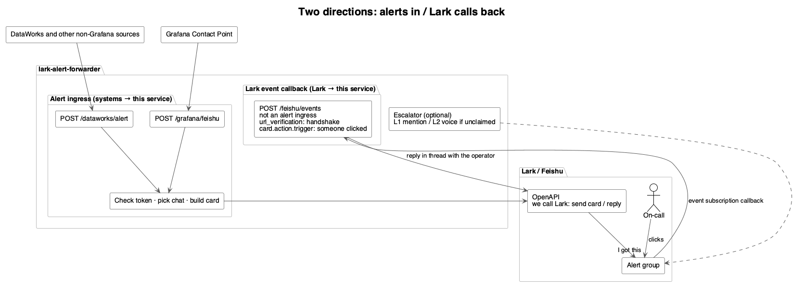
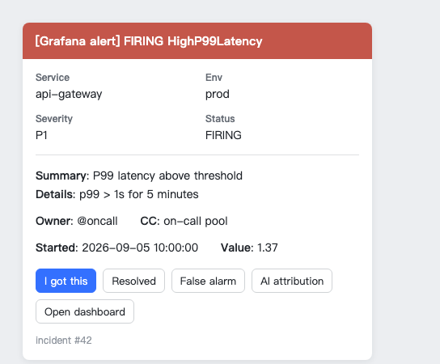

# lark-alert-forwarder

[English](README.md) | [中文](README.zh-CN.md)

Grafana's default webhook JSON cannot be sent to Lark / Feishu as-is. This service turns it into an interactive app-bot card and handles button callbacks.

## Why this exists

Grafana can post webhooks. Lark can receive bot messages. The two still do not meet without a thin adapter, for two reasons:

1. **The payloads do not match.** Grafana's default webhook has no Lark `msg_type`. Pointing a contact point at a Lark webhook fails, or dumps raw JSON into the group.
2. **A group dump is not on-call.** Alerts scrolling in a chat have no owner. Nobody claims them, and an ignored page sinks. The card needs "I got this", and the thread needs a name.

The forwarder stays thin on purpose: accept the alert, build a card, handle the click. On-call tables, AI attribution, and voice calls are optional side paths. If they are unset they never run; if they fail they must not block Grafana → Lark.

## Architecture

The forwarder does three things: accept alerts, turn them into Lark cards, and handle card clicks. On-call routing, attribution, and voice are optional side paths.



`/grafana/feishu` is the alert ingress. `/feishu/events` is Lark's event-subscription callback: Lark posts here after someone clicks a card. It is not a second alert endpoint. Saving the URL in the developer console first sends `url_verification`.

Source: [architecture.en.puml](docs/architecture.en.puml)

When an alert fires:

1. Grafana posts to `POST /grafana/feishu` with `Authorization: Bearer`. Do not point Grafana at Lark; the default payload has no `msg_type`.
2. Sources whose body is not a Grafana webhook (for example DataWorks) post to `POST /dataworks/alert`. The adapter maps them onto the same card path. Routing (`service` / `severity`) and the token can sit on the query string, because those bodies are not a stable schema.
3. The forwarder checks the token, reads labels, and picks a chat via `SERVICE_CHAT_ROUTES` or `FEISHU_P1_CHAT_ID`.
4. With an app bot it sends an interactive card through OpenAPI. With only `FEISHU_WEBHOOK` it falls back to a custom bot, and buttons become links.
5. If `ALERT_BACKEND_URL` is set, it also dedups / opens an incident and loads the on-call assignee.

When someone clicks a card (Lark calls back `/feishu/events`):

1. The click happens on a Lark card. Lark's open platform POSTs `card.action.trigger` here, with the clicker's identity.
2. The forwarder checks the Verification Token / Encrypt Key so it knows the request is from Lark.
3. Claim replies in the original thread via OpenAPI and records the operator. AI attribution calls an optional runner, keeps a short summary in the thread, and can email the full report.

Escalation (optional):

1. The escalator periodically looks at unclaimed alerts.
2. After L1: mention the on-call pool in the same thread.
3. After L2: mention the leader and, for allowlisted severities, place an Aliyun TTS voice call.

## Alert card

The group sees a Lark interactive card, not the raw Grafana JSON. The header is colored by status: **red for FIRING**, **green for RESOLVED**, orange otherwise.



| Area | Content |
| --- | --- |
| Title | `[Grafana alert] FIRING <alertname>` |
| Fields | service, env, severity, status |
| Body | summary and details; repeats add a "merged into incident" line |
| People | owner / CC only appear when on-call routing is configured |
| Actions | App bot: `I got this`, `AI attribution`, `Open dashboard`. `Resolved`, `False alarm`, and silence need the incident backend |
| Footer | `incident #N` when an incident exists |

With only a custom bot, buttons become links and the click has no identity. The assignee also gets a shorter DM asking them to claim in the group first. Full AI reports go to email; the thread keeps a one-line guess.

## Features

- Grafana / DataWorks webhook → Lark interactive card
- Card callbacks such as claim, escalate, and reassign
- Optional on-call routing, voice escalation, and read-only AI attribution
- Falls back to a custom bot webhook when the app bot is not configured

## Quick start

```bash
export FEISHU_WEBHOOK="https://open.feishu.cn/open-apis/bot/v2/hook/xxx"
export GRAFANA_FORWARDER_TOKEN="change-me"
go run .
```

Docker:

```bash
docker build -t lark-alert-forwarder .
docker run --rm -p 8080:8080 \
  -e FEISHU_WEBHOOK="https://open.feishu.cn/open-apis/bot/v2/hook/xxx" \
  -e GRAFANA_FORWARDER_TOKEN="change-me" \
  lark-alert-forwarder
```

Health check: `GET /healthz`.

## Grafana contact point

- URL: `https://<your-forwarder>/grafana/feishu`
- Method: `POST`
- Auth: `Authorization: Bearer <GRAFANA_FORWARDER_TOKEN>`
  (`X-Forwarder-Token` is also accepted)

Do not point Grafana 11 at Lark directly. The default webhook payload has no `msg_type`.

## Configure Lark / Feishu

There are two modes. Claim buttons that identify who clicked, plus thread replies, need an **app bot**. A custom webhook bot can only send cards; buttons become plain links.

### Custom bot (send only)

1. Open the target group → Settings → Bots → add a **Custom bot**.
2. Copy the webhook into `FEISHU_WEBHOOK`.
3. Point Grafana at this service, not at the webhook.

Limit: custom bots cannot reliably identify who clicked a card button.

### App bot (recommended)

Create an **enterprise custom app** at [open.feishu.cn](https://open.feishu.cn/app) (or [open.larksuite.com](https://open.larksuite.com/app)).

1. **Add capabilities** → enable **Bot**.
2. **Permissions** — apply and publish (tenant admin must approve):
   - `im:message` / `im:message:send_as_bot` — send cards and reply in a thread
   - `im:chat:readonly` — list chats the bot is in, to find `chat_id`
   - Add `contact:user.email:readonly` only if you email attribution reports. See [Alert Copilot email](docs/alert-copilot-email.md)
3. **Event subscriptions**:
   - Request URL: `https://<your-forwarder>/feishu/events` (public HTTPS; Feishu sends `url_verification` first)
   - Enable encryption; save the Verification Token and Encrypt Key
   - Subscribe to `card.action.trigger` (card buttons)
   - Also subscribe to `im.message.receive_v1` if you want in-group commands or feedback on-call hints
4. **Version management** — publish a new version and wait for admin approval.
5. Add the bot to the alert group.
6. Get the group `chat_id` (starts with `oc_`):
   - `GET /open-apis/im/v1/chats` with a tenant access token
   - or subscribe to `im.message.receive_v1`, @ the bot, and read `chat_id` from the event

Then set:

```bash
export FEISHU_APP_ID="cli_xxx"
export FEISHU_APP_SECRET="xxx"
export FEISHU_CHAT_ID="oc_xxx"
export FEISHU_VERIFICATION_TOKEN="xxx"
export FEISHU_ENCRYPT_KEY="xxx"
export GRAFANA_FORWARDER_TOKEN="change-me"
```

`FEISHU_P1_CHAT_ID` is optional for a separate P1/P2 chat. Route by service with `SERVICE_CHAT_ROUTES=api=oc_aaa;data=oc_bbb`.

Permission or event changes do nothing until you publish a new app version. Saving a draft is not enough.

## Environment variables

Keep secrets in environment variables or a Secret. Do not commit them.

| Variable | Purpose |
| --- | --- |
| `FEISHU_WEBHOOK` | Custom bot webhook. Required when the app bot is not configured |
| `FEISHU_APP_ID` / `FEISHU_APP_SECRET` / `FEISHU_CHAT_ID` | App bot |
| `FEISHU_P1_CHAT_ID` | Optional. Send P1/P2 to a separate chat |
| `FEISHU_VERIFICATION_TOKEN` / `FEISHU_ENCRYPT_KEY` | Verify / decrypt Lark callbacks |
| `GRAFANA_FORWARDER_TOKEN` | Token for Grafana / DataWorks calls |
| `LISTEN_ADDR` | Default `:8080` |
| `SERVICE_CHAT_ROUTES` | `service=oc_xxx;other=oc_yyy` per-service routing |
| `DIRTY_WORK_CANDIDATES` | `Alice\|ou_xxx,Bob\|ou_yyy`. No built-in default |
| `USER_FEEDBACK_ONCALL_CHAT_ID` / `USER_FEEDBACK_ONCALL_CANDIDATES` | Feedback-group on-call hints |
| `COPILOT_RUNNER_URL` / `COPILOT_RUNNER_AGENT` | Delegate AI attribution to an external runner |
| `COPILOT_RUNNER_COMMAND` | Fork a local command when no runner URL is set |
| `SMTP_*` / `EMAIL_FALLBACK_TO` | Email the full attribution report |
| `ALIYUN_VOICE_*` | L2 voice escalation. See `docs/aliyun-voice-alerting.md` |

Example for DataWorks and other non-Grafana sources (body schema is unstable, so routing lives on the query string):

```text
https://<your-forwarder>/dataworks/alert?token=<GRAFANA_FORWARDER_TOKEN>&service=data-platform&severity=P1&alertname=DataSyncFailed&env=prod
```

## Docs

- [Alert Copilot](docs/alert-copilot.md)
- [Alert Copilot email](docs/alert-copilot-email.md)
- [Aliyun voice alerting](docs/aliyun-voice-alerting.md)
- On-call file example: `configs/alert-oncall.example.yaml`

## License

MIT
