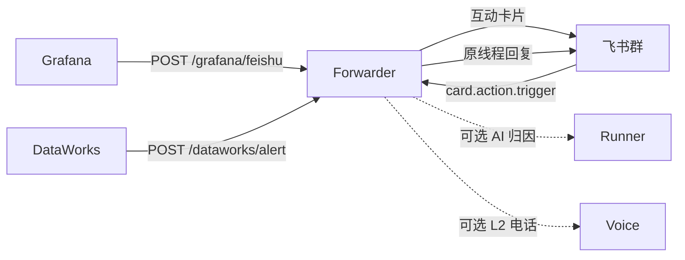

# lark-alert-forwarder

[English](README.md) | [中文](README.zh-CN.md)

Grafana 的默认 webhook JSON 不能直接发给飞书。这个服务把它转成飞书应用机器人互动卡片，并处理卡片按钮回调。

只会填 URL、不能加请求头的来源（例如 DataWorks）可以走 `POST /dataworks/alert`，用查询参数带 token 和路由信息。



## 功能

- Grafana / DataWorks webhook → 飞书互动卡片
- `我来处理`、升级、重新指派等卡片回调
- 可选值班路由、电话升级、只读 AI 归因
- 未配置应用机器人时，回退到自定义机器人 webhook

## 快速开始

```bash
export FEISHU_WEBHOOK="https://open.feishu.cn/open-apis/bot/v2/hook/xxx"
export GRAFANA_FORWARDER_TOKEN="change-me"
go run .
```

Docker：

```bash
docker build -t lark-alert-forwarder .
docker run --rm -p 8080:8080 \
  -e FEISHU_WEBHOOK="https://open.feishu.cn/open-apis/bot/v2/hook/xxx" \
  -e GRAFANA_FORWARDER_TOKEN="change-me" \
  lark-alert-forwarder
```

健康检查：`GET /healthz`。

## Grafana 通知渠道

- URL：`https://<your-forwarder>/grafana/feishu`
- Method：`POST`
- Auth：`Authorization: Bearer <GRAFANA_FORWARDER_TOKEN>`
  （也接受 `X-Forwarder-Token`）

不要让 Grafana 11 直接打飞书。默认 webhook 没有飞书要的 `msg_type`。

## 配置飞书

有两种接法。要「我来处理」识别点击人、并在原线程回复，必须用应用机器人。自定义机器人只能发卡片，按钮只能做成跳转链接。

### 自定义机器人（只发不回）

1. 打开目标飞书群 → 设置 → 群机器人 → 添加 **自定义机器人**。
2. 复制 webhook，配到 `FEISHU_WEBHOOK`。
3. Grafana 照常打到本服务，不要直接打这个 webhook。

限制：飞书自定义机器人没有可靠的卡片回调身份，点「我来处理」无法知道是谁。

### 应用机器人（推荐）

在 [飞书开放平台](https://open.feishu.cn/app) 创建**企业自建应用**。

1. **添加应用能力** → 启用 **机器人**。
2. **权限管理** 申请并发布（管理员审批）：
   - `im:message` / `im:message:send_as_bot`：以机器人身份发卡片、回线程
   - `im:chat:readonly`：列出机器人所在群，方便拿 `chat_id`
   - 要用邮件归因时再加 `contact:user.email:readonly`，见 [Alert Copilot 邮件](docs/alert-copilot-email.md)
3. **事件订阅**：
   - 请求网址：`https://<your-forwarder>/feishu/events`（必须公网 HTTPS，飞书会先发 `url_verification`）
   - 打开加密，记下 Verification Token、Encrypt Key
   - 订阅 `card.action.trigger`（卡片按钮）
   - 若要用群内指令或反馈值班，再订 `im.message.receive_v1`
4. **版本管理** 发布新版本，等租户管理员通过。
5. 把机器人拉进告警群。
6. 取群 `chat_id`（`oc_` 开头）：
   - 用 tenant token 调 `GET /open-apis/im/v1/chats`
   - 或先订 `im.message.receive_v1`，在群里 @ 机器人，日志/回调里会带 `chat_id`

然后配环境变量：

```bash
export FEISHU_APP_ID="cli_xxx"
export FEISHU_APP_SECRET="xxx"
export FEISHU_CHAT_ID="oc_xxx"
export FEISHU_VERIFICATION_TOKEN="xxx"
export FEISHU_ENCRYPT_KEY="xxx"
export GRAFANA_FORWARDER_TOKEN="change-me"
```

`FEISHU_P1_CHAT_ID` 可选，P1/P2 另投一个群。多个服务分流用 `SERVICE_CHAT_ROUTES=api=oc_aaa;data=oc_bbb`。

改完权限或事件后必须重新发布应用版本，只保存草稿不会生效。

## 环境变量

密钥只放环境变量或 Secret，不要写进仓库。

| 变量 | 用途 |
| --- | --- |
| `FEISHU_WEBHOOK` | 自定义机器人 webhook。未配应用机器人时必填 |
| `FEISHU_APP_ID` / `FEISHU_APP_SECRET` / `FEISHU_CHAT_ID` | 应用机器人 |
| `FEISHU_P1_CHAT_ID` | 可选。P1/P2 另投一个群 |
| `FEISHU_VERIFICATION_TOKEN` / `FEISHU_ENCRYPT_KEY` | 校验 / 解密飞书回调 |
| `GRAFANA_FORWARDER_TOKEN` | Grafana / DataWorks 调用本服务的 token |
| `LISTEN_ADDR` | 默认 `:8080` |
| `SERVICE_CHAT_ROUTES` | `service=oc_xxx;other=oc_yyy` 按服务分流 |
| `DIRTY_WORK_CANDIDATES` | `Alice\|ou_xxx,Bob\|ou_yyy`，无默认值 |
| `USER_FEEDBACK_ONCALL_CHAT_ID` / `USER_FEEDBACK_ONCALL_CANDIDATES` | 反馈群值班提示 |
| `COPILOT_RUNNER_URL` / `COPILOT_RUNNER_AGENT` | 把 AI 归因交给外部 runner |
| `COPILOT_RUNNER_COMMAND` | 未配 URL 时 fork 本地命令 |
| `SMTP_*` / `EMAIL_FALLBACK_TO` | 把完整归因报告发邮件 |
| `ALIYUN_VOICE_*` | L2 电话升级，见 `docs/aliyun-voice-alerting.md` |

DataWorks 示例：

```text
https://<your-forwarder>/dataworks/alert?token=<GRAFANA_FORWARDER_TOKEN>&service=data-platform&severity=P1&alertname=DataSyncFailed&env=prod
```

## 文档

- [Alert Copilot](docs/alert-copilot.md)
- [Alert Copilot 邮件](docs/alert-copilot-email.md)
- [阿里云语音告警](docs/aliyun-voice-alerting.md)
- 值班配置示例：`configs/alert-oncall.example.yaml`

## License

MIT
